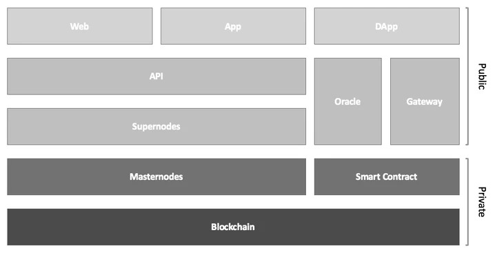
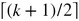
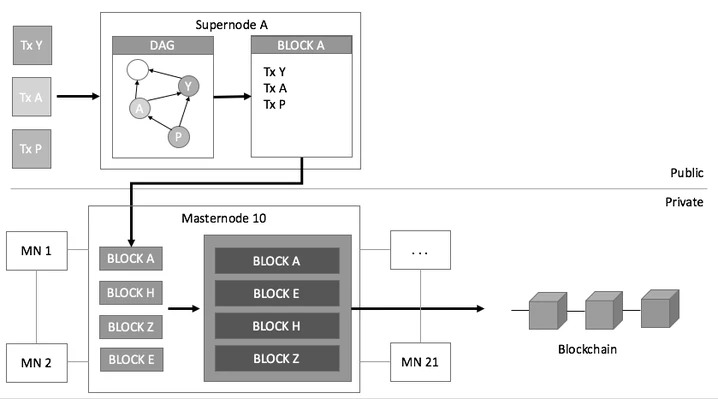
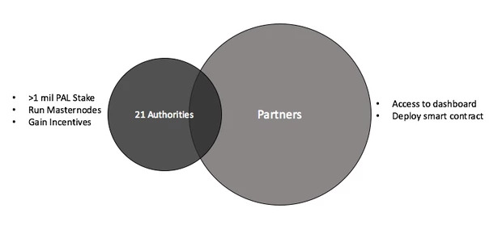
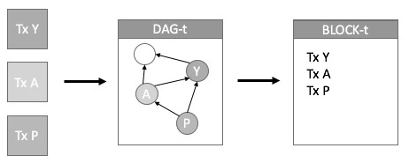
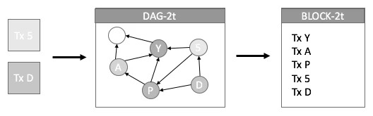
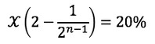

# PolicyPal Network Blue Paper

**Update Note: More information will be included/updated over the protocol development phase.**

# Table of Content

- [1. Introduction](#1-introduction)
- [2. Problem](#2-problem)
    - [2.1 Privacy](#21-privacy)
    - [2.2 Scalability](#22-scalability)
    - [2.3 Cost](#23-cost)
- [3. PolicyPal Network Protocol](#3-policypal-network-protocol)
    - [3.1 Private Layer](#31-private-layer)
        - [3.1.1 Blockchain (PoSA)](#311-blockchain-posa)
        - [3.1.2 Smart Contract](#312-smart-contract)
    - [3.2 Public Layer](#32-public-layer)
        - [3.2.1 Gateway](#321-gateway)
        - [3.2.2 Oracle](#322-oracle)
        - [3.2.3 API ](#323-api)
- [4. Nodes](#4-nodes)
    - [4.1 Masternode](#41-masternode)
        - [4.1.1 How it Works](#411-how-it-works)
        - [4.1.2 Authorities & Partners](#412-authorities--partners)
    - [4.2 Supernode](#42-supernode)
        - [4.2.1 How It Works](#421-how-it-works)
        - [4.2.2 Staking](#422-staking)
- [5. Fee & Incentive Structure](#5-fee--incentive-structure)
    - [5.1 Fee](#51-fee)
    - [5.2 Annual Incentive](#52-incentive)
- [6. Penalty](#6-penalty)
    - [6.1 Malicious Acts](#61-malicious-acts)
    - [6.2 Dropping Transactions](#62-dropping-transactions)
- [7. Summary](#7-summary)
- [8. References](#8-references)

## 1. Introduction
The traditional insurance ecosystem is ripe for disruption. Currently, it constitutes complex processes with paperwork, manual interventions, and terms and conditions that are hard to understand. They are also built to cater more for companies' needs rather than being customer-oriented. In addition, it results in high costs and delays in claims processing and financial settlements, due to the fact that multiple manual approval levels are required for assessment, as well as the reconciliation between various parties involved. Nowadays, adoption of public blockchain technologies in the insurance industry results in the lack of personal data privacy, congested network, high barriers of entry and slow processing time.

We present PolicyPal Network (https://www.policypal.network), a.k.a. PPN, a decentralised insurance protocol which aims to address these issues and bridge the gap between consumers and insurance providers by providing a new level of accessibility within the insurance ecosystem. Designed for insurance, PPN is a blockchain protocol that provides an affordable, scalable and secure platform that empowers all the applications in the PPN ecosystem. More specifically, PPN proposes a two-layered (i.e., public layer and private layer) protocol tackling the security and privacy issues of insurance policies. Within the PPN ecosystem, token holders can leverage on our APIs and tools to build dApps (e.g., mutual pool creation, referral programmes, etc.) with smart contracts, which makes decentralised insurance accessible to the next billion customers. Our vision is to make PPN a one-stop marketplace for apps/ dApps/ insurance products powered by the community. 

PolicyPal Network Token (Ticker: PAL) is the native cryptocurrency which powers all the cross and intra-layer transactions in PPN. PAL is the major payment method in the PPN ecosystem, and it can be traded in open markets (e.g., cryptocurrency exchanges).

As a utility token, PAL empowers token holders with an assortment of benefits: 1). It powers PPN by staking them as either a Supernode (a.k.a. SN) or Masternode (a.k.a. MN), 2). It enables token holders to enjoy additional discounts when they trade (buy or sell) insurance policies, 3). It allows token holders to propose or vote new-age insurance products, and 4). It empowers token holders to stake and launch mutual aid insurance pools. It should be noted that PAL is neither a security asset nor anything that is used for price speculation.

## 2. Problem
Applying blockchain technology to the insurance industry is challenging, as it is facing a lot of open issues that are to be addressed.

### 2.1 Privacy
On May 25th, 2018, the European Union (EU) enacted the General Data Protection Regulation (GDPR) in EU states, imposing heavy penalties on the breach of personal data and privacy [[1](#reference1)]. In Singapore, personal data is protected by the Personal Data Protection Act 2012 (PDPA), where collection/usage/disclosure of personal data must be consented and made known to all individuals. Insurance policies usually contain sensitive personal information (i.e. social security/national identification number, address, date of birth, etc.) and thus will be an egregious breach of personal security and privacy if these insurance policies are stored in public blockchains.  

PPN addresses several issues that may arise from the use of public blockchains leading to the conception of our protocol. In PPN, sensitive information is encrypted and stored in the private layer. Only authorised users (i.e., the owner of the data, or users authorised by the owner) can access and decrypt the data.

### 2.2 Scalability
Network congestion is becoming one of the biggest challenges in blockchain. As blockchain technology becomes more mainstream and popular, the increasing number of transactions may result in frequent network congestion and higher transaction latency. For instance, Bitcoin has a limit on the block size (i.e., 1MB), and Ethereum set a gas limit (6.7 million gas) on each block, which severely limits their transaction carrying capacity. Moreover, Ethereum’s scalability issues were made very clear when the viral success of CryptoKitties slowed down the entire Ethereum network.

The scalability of a blockchain depends on two main factors: 1). How long it takes for a transaction to be transferred and put into the block to be confirmed, and 2). How long it takes for all (or majority of some Byzantine nodes are considered) the nodes to reach a consensus. The typical recipe for scaling performance of traditional distributed systems decades ago is to shard (or partition) the state of the application (more recent research is shown in [[2](#reference2)][[3](#reference3)][[4](#reference4)]), and it has been applied to the blockchain space to try to address the scalability issue. If the sharding is performed in such a way that most requests can be executed within a single shard and the load among shards is balanced, then performance may scale up with the number of shards. Unfortunately, large scale applications can hardly be optimally sharded, considering the heterogeneity and churn of the dynamic systems. As a result, the system must handle requests that span multiple shards, which will most likely reduce the overall system performance. Recently, some Directed Acyclic Graph- (DAG) based protocols (e.g. [[5](#reference5)][[6](#reference6)]) were proposed to speed up the transactions, and enable micro-payments. However, DAG-based protocols usually do not (or struggle to) maintain a total order over all transactions, which is critical to support applications like smart contracts. 

PPN addresses the scalability issue via applying PoAS consensus (derived from PoA [[7](#reference7)]) in the private layer of the blockchain, where 21 authorised MNs will produce blocks containing the transactions sent from the public layer and reach the consensus on the confirmed block. Section 3 will provide more details of the PoAS consensus protocol used in PPN.

### 2.3 Cost
Traditional Proof-of-Work-(i.e., PoW) based blockchains are powered by expensive mining rigs, not to mention the high electricity bill that comes with it. In addition to the power, blockchains require every node to consume storage to store the duplicated ledger. The storage cost is modest at start, but it will go up over time [[8](#reference8)].

Apart from operation costs (e.g., running a node to be a miner in the Bitcoin network), the transaction fee is highly dependent on the network, where spikes in fees occur when the network is congested. Such spikes and uncertainty in fees make it unfeasible for business operations, as one may be paying an extra $2 for a $3 cup of coffee. For example, Steam, a digital distribution platform developed by Valve Corporation, has ceased support for Bitcoin as a payment method on their platform due to high fees and volatility in the value of Bitcoin [[9](#reference9)]. 

PPN provides a dynamic and heterogeneous fee structure which is designed to make trading insurance policies affordable over time, while at the same time be able to be adjusted by the issuers and policy underwriters according to the products they want to provide in PPN.

## 3. PolicyPal Network Protocol
PPN provides solutions for the problems above via designing and developing a two-layered protocol, which leverages the advantages of the private and public blockchain in a holistic manner.

**Security**. With the inclusion of a permissioned blockchain in the private layer, PPN appoints only trusted partners to operate in the private layer of the network, resulting in high data integrity and security in the network.

**Privacy**. Contrary to general belief, public blockchains are not fully anonymous. Every transaction is discoverable by anyone. With enough effort, all the data can be traced back to the genesis block. As a result, having a private network is paramount in providing encapsulation to restricted data. Users will still be able to submit transactions normally, but data retrieval will be filtered. In the current age, ensuring that sensitive details are transparent only to dedicated parties are of utmost priority, especially to our trusted partners, which adhere to modern enterprise security standards and regulations like PDPA and GDPR.

**Scalability**. In conjunction with the separation of the public and private layer, the protocol will be able to maximise efficiency in the generation of blocks. Compared to traditional blockchains, where every transaction is broadcasted once it is created, transactions in PPN will be validated by SNs and then attached to the SN's DAG in an independent manner. Every SN will sort the DAG of the valid transactions, then send the sorted DAG (in a block) to the private layer for confirmation. As a result, the propagation delay is significantly reduced since transactions no longer float in a transaction pool waiting to be picked up. Within the private layer, with an ideal number of 21 MNs for consensus, blocks can be generated and confirmed in near optimal time, thus the throughput can be significantly improved.

**Cost**. In retrospect, cost per transaction fluctuates according to network congestion for confirmation. PPN alleviates this problem by distributing work to SNs and MNs. By bearing the load, users only need to provide a nominal fee for each transaction to be validated by SNs. As there is no mining within the protocol, there is no need for expensive mining rigs.

We now describe the architecture of PPN, as shown in Figure 1, in more details in the following sections.
<figure>
    
    <figcaption style="text-align: center;">
        Figure 1: PolicyPal Network Architecture
    </figcaption>
</figure>

### 3.1 Private Layer
The purpose of the private layer ensures the security and privacy of the blockchain, restricting access of sensitive insurance policy data and policyholders' information to only trusted parties. It is powered by a limited number of MNs to ensure efficiency and integrity. To be a MN, a significant amount of stake needs to be held, and the candidate needs to be approved by the majority of existing MNs.

#### 3.1.1 Blockchain (PoSA)
PPN's private layer applies Proof-of-Staking-Authority (PoSA) consensus derived from Proof-of-Authority (PoA) [[7](#reference7)]. PoSA is a consensus model with identity at stake, meaning the block validators (i.e. authorities) are assigned and given the power to mine blocks, without the need to solve computation puzzles like Proof-of-Work [[10](#reference10)]. Block validators are equal and consensus is reached at  approvals where `k` is the number of validators. PoSA enforces PoA by introducing the element of staking in order to be qualified to become an authority.

Furthermore, there is always a chance for authorities to become a threat if they decide to go against the network. By introducing Staking-Authority, authorities are required to stake a minimum amount in order to be qualified to run a masternode, lowering the possibility of malicious activities by having their asset at stake. Additionally, while PoA usually does not incentivise block creators, block creators will be rewarded in PoSA. This ensures higher integrity and security in the network without compromising the speed.

#### 3.1.2 Smart Contract
The advantages of smart contracts are accuracy, speed and trust. With smart contracts, it is a requirement to record all terms and conditions explicitly. Excluding any of the data required will result in a transaction error. This ensures the accuracy of transactions as compared to the error-prone process of manually filling up forms. The accuracy of data is especially important in the scenario of purchasing an insurance policy, where accurate user data is required to purchase an insurance policy or to file a claim. Other than ensuring the accuracy of data, smart contracts also provide the speed required. Smart contracts allow the fast execution of transactions as they run on software code. With smart contracts, there is no longer a need to process documents manually. This speed can be obtained from the removal of hours off the traditional processes of purchasing an insurance policy where a number of middlemen are involved. More importantly, with the use of smart contracts, we are able to ensure trust within the network. As transactions executed by smart contract are transparent, autonomous and secure, it eliminates the chance of transactions being subjected to manipulation, bias or error. This trust is essential to provide insurers the confidence to deploy insurance policies (as smart contracts) onto PPN as it prevents the possibility of invalid transactions, such as fraudulent claims from being verified.

With these advantages in mind, PPN will be providing the ability for insurers and partners to customise smart contracts according to their specifications for certain use cases. These smart contracts can be customised from a set of templates provided by PPN and these customisations can be made hassle-free from a dashboard, which will be provided. As for users, they, too, will be able to propose and create smart contracts for Mutual Aid Pool or other insurance products. However, creation of these smart contracts by users will be subjected to the restrictions that they are only able to create the smart contracts from the templates provided as these templates will be audited to ensure that they are safe for the network. Whereas for insurers and partners, they are not subjected to the same restriction and they are able to create smart contracts that are not restricted by the templates provided.

### 3.2 Public Layer
The public layer consists of an indefinite number SNs who collect and validate transactions from end users (e.g., Apps, Webs, etc.) independently and concurrently. It plays an integral role in serving cross-layer transactions from the token holders/oracles/apps/dApps/other blockchains to the private layer.

SNs can be run by anyone in the community fulfilling a minimum number of PAL staking. They serve as the first layer of defense for the network, filtering off suspicious, spam transactions and other forms of attacks from the private net. More specifically, SNs validate the transactions (from end users) to form a Directed Acyclic Graph (DAG) [[11](#reference11)] on the valid transactions. By using the advantages of DAG, transactions can be verified quickly in parallel while still enabling them to be sorted.

#### 3.2.1 Gateway
The Gateway provides limited direct access to the private net. It mainly provides data to the dashboard for authorities to access private data, verify policy and deploy smart contracts. The Gateway also assists the API to retrieve public data such as token amounts and basic policy information. It can also broadcast the latest confirmed block from the private layer to the public layer. Thus, SNs can use the confirmed block to validate transactions received from the end users.

#### 3.2.2 Oracle
Oracles are multiple trusted third-party sources which provide real-world data feeds to smart contracts. Information such as flight delays, weather conditions, natural disasters etc can be obtained through the oracle. With that, smart contracts can automatically trigger upon reaching a stated number of verifications by oracles.

#### 3.2.3 API 
PPN provides a public RESTful API which encourages developers to build applications on top of our protocol. API enables partners, other blockchain companies or anyone to integrate PPN products and expand the ecosystem. The API will include basic token functions such as querying or making transactions, as well as special functions like retrieving individual policy information from the blockchain and participating in mutual aid pools.

## 4. Nodes
In PPN, nodes are (virtual) machines that are running PPN's open source software (published in Github). There are two types of nodes in PPN: MN (i.e., masternode) and SN (i.e., supernode). 

### 4.1 Masternode
MNs are capped at 21 to ensure efficiency and manageable security while balancing with centralisation [[12](#reference12)]. It is a good starting number for consensus and it has been adopted by other projects, namely EOS [[13](#reference13)]. Every MN keeps the full copy of the blockchain and differs in functionality from SNs as they can communicate with other MNs, where a consensus can be achieved with Byzantine fault tolerance (BFT) [[14](#reference14)] before adding a block into the blockchain. With such importance, MNs adhere to a strict security protocol that only accepts requests from SNs. Authorities running MNs receive incentives when they validate transactions and successfully create a block in the blockchain.

##### 4.1.1 How it Works
When a package of transactions is received from a SN in the public layer, the MN will broadcast the packages received to the network to be picked up by the block creator. The block creator gathers and sorts the packages in time order before merging them into a final block. The final block is broadcasted to the network again for verification which is added to the blockchain upon reaching consensus. By applying PoSA, MNs will take turns to be the block creator.

<figure>
    
    <figcaption style="text-align: center;">
        Figure 2: Transaction Workflow
    </figcaption>
</figure>

<figure>
    
    <figcaption style="text-align: center;">
        Figure 3: Successful flow from a transaction to blockchain
    </figcaption>
</figure>

#### 4.1.2 Authorities & Partners
Only authorities are allowed to run MNs and a minimum stake is required for an authority who wishes to participate as a MN. It should be noted that MNs do not have access to the dashboard or create smart contracts, which are only enabled for partners (e.g., insurers, policy underwriters, etc.). The main role of MNs is to secure the network and verify transactions, which rewards them with incentives. In an event where a new candidate is approved by the majority of existing MNs, the existing authority with the least stake will be replaced by the new authority.

Partners do not need to hold any stake, nor receive any incentive from the network. They are trusted parties like insurers who can provide underwriting for the insurance policy for the community. Partners have access to the dashboard and have the ability to create and deploy smart contracts through the dashboard. They can also support mutual aid pools proposed by the community. Partners who are interested are free to stake to become an authority candidate.

In order to qualify as an authority, one needs to hold a minimum stake of 1,000,000 PAL for at least 14 days before applying to be a candidate through the network. Authorities will risk having their status removed by the network if their stake goes below the minimum amount.

<figure>
    
    <figcaption style="text-align: center;">
        Figure 4: Authorities and Partners
    </figcaption>
</figure>

### 4.2 Supernode
The main contribution of a SN is pre-verifying a transaction and filtering them before being sent to the private layer. They are also the ones who offload the private layer by adhering to a difficulty nonce set by the private layer, which dynamically adjusts the difficulty to attach transactions to the DAG. The difficulty is usually low and will be adjusted depending on the load of the private layer. Completing the task will yield the SN PAL incentive for the work.

In the case when a SN goes rogue (i.e. alters a transaction, flood the private layer, etc.), it will be penalised of its staked tokens. Since incentives are rewarded per transaction basis, sending less transaction does not benefit the SN. Any rogue SN will be penalised and removed from the network with their account frozen. Transactions sent from end users will be distributed amongst all SNs by random, thus there is no _stake-bullying_ and unfair favouritism in the public layer ecosystem.

#### 4.2.1 How It Works
SNs are lightweight nodes which can be run on low-specs computers. They do not need to sync up with the blockchain, but only the header of the latest confirmed block broadcasted by the Gateway in the public layer.

More specifically, the main task of SN is to collect, verify, process, package and send transactions to the private layer within a time interval (epoch). All transactions the SN received in each epoch will be verified (with the latest block) and attached to a DAG with a simple PoW to prevent spamming. The PoW difficulty can be dynamically adjusted by the private layer, making it easier or harder to attach a transaction according to the load and transaction volume of the private layer.

Towards the end of each epoch, every SN applies a topological sort on the DAG, and the sorted transactions will be packaged and sent to the private layer where MNs will create a block to contain all the packages they receive from the public layer and attach to the blockchain after the consensus is achieved.

At the beginning of the next epoch, every SN syncs up again with the private layer for the latest block though Gateway, with which SNs can check whether their transactions have been successfully recorded into the blockchain:

1. If all transactions exist in the block; 100% recorded, SN can safely clear previous DAG
2. If no transactions exist in the block; 0% recorded, SN needs to duplicate previous DAG to current epoch and attach any new transaction to it and resend. (Figure 6)
3. If some transactions exist in the block; <100% recorded, SN can safely clear previous DAG as the rejected transaction(s) are likely invalid or conflict with other transactions that have been confirmed.

| Epoch Cycle | Events in Supernode |
|-------------|---------------------|
| 1 |	1. SN receives transactions Y, A, and P.   2. After verifying all the transactions, it creates a new local DAG and attaches the transactions to it.   3. SN sorts the transaction and package into a block to be sent to the private layer.      Figure 5: Illustration of Supernode task in an epoch |
| 2	| 1. Case 2 occurred, where no previous transactions exist in the latest block.   2. SN receives new transactions.   3. SN attaches new transactions to existing DAG.   4. SN sorts the transaction and package into a block to be sent to Masternode.      Figure 6: Illustration of Supernode with transaction not added to the blockchain |

#### 4.2.2 Staking
A wallet application will be provided for the community to run a SN, and each address is only allowed to run one SN at a time. The address is required to hold the minimum amount for at least 14 days before they are qualified. If anytime the stake goes below the minimum amount, the 14 days requirement will be reset with the SN status removed. The minimum staking amount is 100,000 PAL

## 5. Fee & Incentive Structure

### 5.1 Fee
Fees will be incurred by the sender and rewarded to SNs and MNs for performing verifications and attaching it to the blockchain. With different types of transactions (such as token transfers, contract deployment, vote casting, claim requests, premium payments, etc), we propose a flexible fee structure which will be introduced at a later date for sustainability of the network.

There will be no transaction fees for all transactions for the first year of the main-net's operation.

From the second year onwards, fees will be collected from the sender, as shown in the table below. This fee will be distributed to the respective SNs and MNs. 20% of the fee collected will go to the PPN Incentive Pool, which will be distributed monthly to qualified SNs according to their stake.

| Party | Incentive |
|-------|-----------|
| Assigned Supernode	| 40% |
| Block Creator Masternode	| 40% |
| PPN Incentive Pool	| 20% |

Example:

1. Alice initiates a transfer of 10,000 PAL to Bob with a fee of 10 PAL.
2. Protocol assigns the task to a SN, say SN-A.
3. SN-A verifies the transaction and sends to the private layer.
4. A MN, say MN-A, verifies the transaction and add it to a confirmed block.
5. MN-A will collect 10 PAL from Alice and distribute it as the incentive:
- 4 PAL (40%) to be rewarded to the SN-A.
- 4 PAL (40%) to be rewarded to the MN-A (i.e., the block creator).
- 2 PAL (20%) to be added into the PPN Incentive Pool.

### 5.2 Annual Incentive
To incentivise nodes to power the network, 20% of the token supply will be allocated to give out annual incentives. This amount will be spread over up to 10 years, as shown according to the formula below.

For reference, the total token supply, as highlighted in our Whitepaper, is 1,000,000,000 (1 billion) PAL. 20% of this is thus 200 million PAL.

This annual incentive is additional on top of whatever nodes earn from transaction fees.

where n is the number of years, and x and y (shown in the table below) are the percentage of PAL that will be distributed as incentives in the 1st year, and the total token supply, respectively.

| Year | Annual Incentive (based on minimum stake) |
|------|-------------------------------------------|
| 1	| 10% of y will be distributed to SNs & MNs|
| 2	| 5% of y will be distributed to SNs & MNs|
| 3	| 2.5% of y will be distributed to SNs & MN|
| ... | |
| 10 |	0.019% of y will be distributed to SNs & MNs|

*To be qualified, nodes must hold the minimum stake and process at least one transaction within the month.

## 6. Penalty
### 6.1 Malicious Acts
Nodes that behave in an unpredictable manner and does not perform as intended would be removed from the network and risk having their account frozen. Frozen accounts may no longer receive transactions and will not be rewarded with any incentives. Depending on the scale of the threat and the severity of these acts, the duration of an account freeze period will vary accordingly.

A non-exhaustive list of possible malicious acts that might be performed by a Supernode includes
- modification of transactions which compromises the data integrity of the network, such as the timing or order of transactions
- performing a DDoS attack on the network by spamming a large number of transactions 
- exploiting the network to consume an unreasonable amount of resources
- packing malicious transactions into blocks to be sent to the Masternodes

These malicious acts are mitigated with the introduction of a system where a minimum amount of PAL tokens is required to be staked in order for one to become a node. With this measure, addresses of nodes can be identified and penalised accordingly if they are found to be carrying out any malicious acts. This will discourage nodes from carrying out any malicious acts as they risk losing their stake with their account frozen. On top of this, an internal monitoring system will be developed to detect these malicious activities to ensure the health of the network.

### 6.2 Dropping Transactions

The network keeps a connectivity log and flags Supernodes who are constantly dropping transactions. Flagged Supernodes will not be able to receive any tasks within a small timeframe, this timeframe increases everytime a Supernode is flagged. This promotes Supernodes to stay healthy and stable in order to maintain their chance of receiving transactions.

On rare cases whereby a Masternode drops transactions, the effect will be minimal as transactions can still be verified by sending the package to other Masternodes. However, Masternodes showing signs of instability may risk being voted out.

## 7. Summary
PPN's two-layer protocol provides an industry-first ecosystem that will close the gap between consumers and insurance providers. The perfect balance of private and public layer of the PPN Protocol allows for discovery of next-generation insurance products that are missing in the traditional age-old insurance industry. PPN's public layer tools, APIs, dashboard interfaces and insurance marketplace empower users in the ecosystem to be able to find/create/purchase comprehensive insurance products that fit their needs and get insured anytime, anywhere. Consumers will have more control and no longer have to go through rigid and cumbersome processes to obtain insurance coverage to set their mind at ease. Supplementary to the public layer, the private layer is a strong foundation in the Protocol providing a trustless system with immutable data and verified transactions that are protected by PPN and its' trusted Masternodes via Proof-of-Staking-Authority (PoSA) consensus. 

## 8. References

[ <a id="reference1">1</a> ] Samuel Martinet, GDPR and Blockchain, https://cointelegraph.com/news/gdpr-and-blockchain-is-the-new-eu-data-protection-regulation-a-threat-or-an-incentive, May 2018

[ <a id="reference2">2</a> ] J. C. Corbett, J. Dean, M. Epstein, A. Fikes, C. Frost, J. J. Furman, S. Ghemawat, A. Gubarev, C. Heiser, P. Hochschild et al., "Spanner: Google's globally distributed database," ACM Transactions on Computer Systems (TOCS), vol. 31, no. 3, p. 8, 2013

[ <a id="reference3">3</a> ] C. E. Bezerra, F. Pedone, and R. Van Renesse, "Scalable state-machine replication", in DSN, 2014

[ <a id="reference4">4</a> ] L. H. Le, C. E. Bezerra, and F. Pedone, "Dynamic scalable state machine replication", in DSN, 2016

[ <a id="reference5">5</a> ] A. Churyumov, "Byteball: a decentralized system for storage and transfer of value", 2017

[ <a id="reference6">6</a> ] S. Popov, "The tangle version 1.3", IOTA Foundation, Tech. Rep., October 2017

[ <a id="reference7">7</a> ] S. De Angelis, L. Aneillo, R. Baldoni, F. Monbardi, A. Margeheri, and V. Sassone, PBFT vs Proof-Of-Authority: Applying the CAP Theorem to Permissioned Blockchain, https://eprints.soton.ac.uk/415083/2/itasec18_main.pdf, January 2018

[ <a id="reference8">8</a> ] Jason Bloomberg, Don't Let Blockchain Cost Savings Hype Fool You, https://www.forbes.com/sites/jasonbloomberg/2018/02/24/dont-let-blockchain-cost-savings-hype-fool-you/, February 2018

[ <a id="reference9">9</a> ] Kurtis, Steam is no longer supporting Bitcoin, https://steamcommunity.com/games/593110/announcements/detail/1464096684955433613, December 2017

[ <a id="reference10">10</a> ] Satoshi Nakamoto, Bitcoin: A peer-to-peer electronic cash system, https://bitcoin.org/bitcoin.pdf, October 2008

[ <a id="reference11">11</a> ] Marcelo Fiore and Marco Devesas Campos, The Algebra of Directed Acyclic Graphs, http://www.cl.cam.ac.uk/~mpf23/papers/Algebra/dags.pdf, March 2013

[ <a id="reference12">12</a> ] Sunny Aggarwal, Adrian Brink and Ethan Frey, Consensus Compare: Tendermint BFT vs EOS dPOS, https://blog.cosmos.network/consensus-compare-tendermint-bft-vs-eos-dpos-46c5bca7204b, September 2017

[ <a id="reference13">13</a> ] Colin Harper, EOS Hype Builds as Over 50 Candidates Vie for 21 Supernodes, https://bitcoinmagazine.com/articles/eos-hype-builds-over-50-candidates-vie-21-supernodes/, April 2018

[ <a id="reference14">14</a> ] Miguel Castro and Barbara Liskov, Practical Byzantine Fault Tolerance, http://pmg.csail.mit.edu/papers/osdi99.pdf, February 1999
